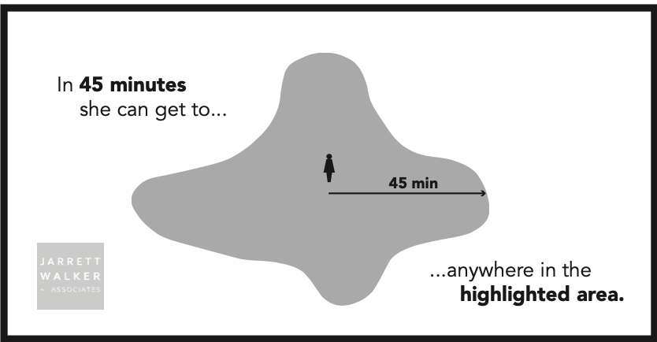

# Transit Accessibility Analysis

## App Overview

This app shows the countywide transit accessibility for two transit networks. Right now, the app is set to show the differences between Fall 2023 Metro service and Fall 2023 Metro service if Route 7 was deleted. This will eventually change to show actual transit restructure scenarios and/or Metro Connects.

The app can be used to look at access to different types of destinations and jobs throughout a typical week. Use the filters on the map to choose a start time for the trip, a maximum trip length, a display geography and a metric. More on metrics in a minute.

## Defining Transit Accessibility

**Transit Accessibility:** How many places someone can get to using transit in a certain amount of time from their starting location.

{width="80%"}

{width="80%"}

{width="80%"}

{width="80%"}

Accessibility is important to measure because it can determine how much of a person's travel needs can be completed on an existing or planned transit network. Countywide analysis of accessibility can highlight transit deserts, which gives planners an opportunity to strategically improve transit connections to important destination. Metro's strategic plan calls for annual measurements in the change in county-wide transit accessibility.

At a theoretical level, accessibility is simple. However, the process of measuring transit accessibility requires iteration. This is where R plays a critical role, as traditional transit planning tools require planners to manually select analysis locations one-by-one, which is not possible at a county-wide scale.

### r5R to the Rescue!

r5R is a network based routing tool that allows analysts to model time-based travel for different modes of transportation. It is an opensource software package made by the firm Conveyal.

r5R uses a java backend, the Open Street Map Network and the GTFS to allow analysts to model time-based travel for different modes of transportation. It allows for use of different time decay functions ( a quick trip to a destination is worth more than a long trip).

### A quick look at r5r

-   Requires:

    -   Open Street Map network file

    -   Origin and destination points

    -   General Transit Feed Specifications (GTFS)

-   Implements decay curves to model how people perceive opportunities (a quick trip to a destination is worth more than a long trip).

-   Full documentation available [here](https://ipeagit.github.io/r5r/index.html)

### r5r at King County

-   Destinations Database for destinations

-   First calculated using a quarter mile hexagon map, then aggregated using population weighted interpolation

## Access Strength

The idea behind the Access Strength metric is that people need to have access to a variety of goods and services to have a high quality of life. By measuring transit access to different types of destinations, we can see how changes to the transit network impact the quality of life in our communities.

### Destinations Groupings

Right now, the Access Strength metric includes the following types of destinations:

-   Assistance (accessibility & disability assistance, food banks, ORCA LIFT enrollment centers, senior centers, WIC vendors, work source sites)

-   Day Care Centers

-   Grocery Stores & Farmers Markets

-   Health & Wellness (Federal Qualified Health Centers, Tribal Health Centers, hospitals, residential treatment centers, WIC clinics)

-   Housing (assisted living facilities, emergency shelters, housing entry points, nursing homes)

-   Municipal Services (election drop boxes, city halls)

-   ORCA fare outlets

-   Parks (all parks in King County larger than two acres)

-   Primary Education

-   Public Spaces (community centers, libraries, places of worship)

-   Secondary Education (colleges & apprentice programs)

-   Shopping Centers

### Creating the Access Strength Metric

While the destinations database codes each type of destination specifically, we are grouping assets into categories in this metric because we wanted a generalized metric of accessibility. For example, people who are not seniors may not need to regularly travel to a nearby senior center. By putting senior centers in the Assistance category, we are able to look at a cross-section of user needs in a community. However, if access to a particular asset or asset type is of interest, other metrics in the app are available for those questions.

We found that the county average for the number of assets of each group that were accessible via transit was 2 and that the data had a sharp right skew, with most areas of the county having access to at least one asset in each group but few having access to ten or more. In other words, most places have some transit access to destinations, but due to the location of the destinations and the design of the transit network, the distribution is not even across the county.

In order to focus our attention on where needs are greatest, we decided to design the metric using the following logic:

-   Starting location has access to:

    -   2+ destinations in the group –\> sufficient access

    -   1 destinations in the group –\> some access

    -   0 destinations in the group –\> no access

After calculating the access score for each location for each type of asset, we add the scores together and divide by 12 (the number of asset groups). This gives us a 0 - 1 score that represents the overall level of access that each location has to a variety of destinations.

By calculating the Access Strength metric for two networks, we can see how the changes to the transit network affected overall access across the county. If there are particular destinations groups that are important to focus on, use the metrics below to look at each asset group individually.

## Filters

-   **Day:** Day of week that the trip occurs on.

-   **Trip Start Time:** Time period that the traveler begins their journey.

    -   All Day (6 AM - 8 PM): Models a 14 hour window of travel time. Results show places that can be reached in 50% of travel itineraries. The model samples each origin 5 times every minute and provides a summary of accessibility.

    -   AM (6 AM - 9 AM): Models the average trip made during the morning peak period.

    -   MID (9 AM - 3 PM): Models the average trip made during the midday period.

    -   PM (3 PM - 7 PM): Models the average trip made during the evening peak period.

    -   EVE (& PM - 10 PM): Models the average trip made during the evening period.

-   **Geography:** The geographic unit of analysis. Right now the options are block group and quarter mile hexagons. Results are first calculated for the hexagons and then population-weighted spatial interpolation is used to scale the results to the block group level.

-   **Asset Type:** Filters the metrics to show only the results for a particular asset group (see above). Does not apply to Access Strength metrics.

-   **Metric:** See below.

## Metrics in the App

-   **Possible Destinations Baseline:** Count of assets in the selected asset group that are accessible via the baseline transit network at the day and time selected in the app filters. Presents a raw count of the number of assets.

-   **Possible Destinations Proposal:** Count of assets in the selected asset group that are accessible via the proposed transit network at the day and time selected in the app filters. Presents a raw count of the number of assets.

-   **Change In Possible Destinations:** Change in the raw number of assets accessible between the two networks. Responds to all filters. A negative number means that the proposed network has less access than the baseline network.

-   **Percent Change In Possible Destinations** Percent change in the raw number of assets accessible between the two networks. Responds to all filters. A negative number means that the proposed network has less access than the baseline network.

-   **Access Strength Baseline:** The composite indicator of level of access to the asset groups included in the Access Strength for the baseline network. Numbers should be interpreted as a percentage where 0 represents no access and 100 indicates sufficient access in all asset categories.

-   **Access Strength Proposal:** The composite indicator of level of access to the asset groups included in the Access Strength for the proposed network. Numbers should be interpreted as a percentage where 0 represents no access and 100 indicates sufficient access in all asset categories.

-   **Change In Access Strength:** The difference in the Access Strength score for the two networks. This should be interpreted as a percent difference.

-   **Access Range Baseline:** The number of distinct types of destinations that can be reached from each origin point using the baseline transit network.

-   **Access Range Proposal:**The number of distinct types of destinations that can be reached from each origin point using the proposed transit network.

-   **Change In Access Range:** The change in the number of distinct types of destinations that can be reached from each origin point between the proposed and baseline transit networks.

## Map Layers

Two map layers are added to enrich the data viewing experience:

-   EPA Overlay: A hatched rendering of block groups that have an equity priority area score of 4 or 5 (high equity area communities).

-   Study Area: Will show the outline of the current project study area (currently SouthLink) on the map.

### Summaries

The summary tab shows the average results for each scenario for the South Link Connections Study area. The results can be interpreted as an average change in the study area between the two networks.
