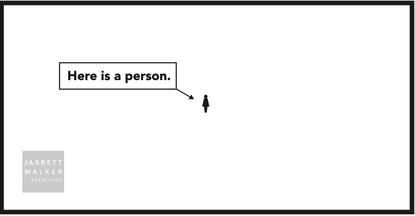

# Accessibility Analysis Dashboard

## About

**Transit Accessibility:** How many places someone can get to using transit in a certain amount of time from a their starting location.

{alt="Au: Jarrett Walker Associates"}

## Metrics

The dashboard has several metrics available for planners. All reference the same data and can be used together to develop an understanding of the scale and size of change in an area.

**Trips/Period:** The number of trips passing through the hexagon on the day (weekday, Saturday, Sunday) and period as selected in the dashboard.

**Avg Trips/Hour:** The number of trips per hour passing through the hexagon on the day (weekday, Saturday, Sunday) and period as selected in the dashboard. For routes with spans of service that only cover a portion of a period, the dashboard assumes that the average should be calculated using the total number of hours in the period. In other words, if a route has its last trip at 7:10 PM, it will have records available in the "7 PM - 10 PM" period, but the average number of trips per hour will be less than 1.

## Metro Connects Growth Scenarios

## More Info

This app was developed in R using shinydashboard by Melissa Gaughan. For code and technical documentation see <https://github.com/melissa-gaughan/accessibility>
